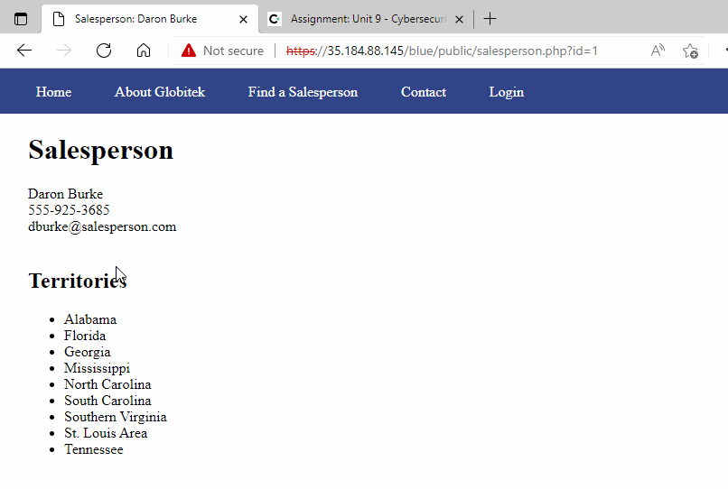
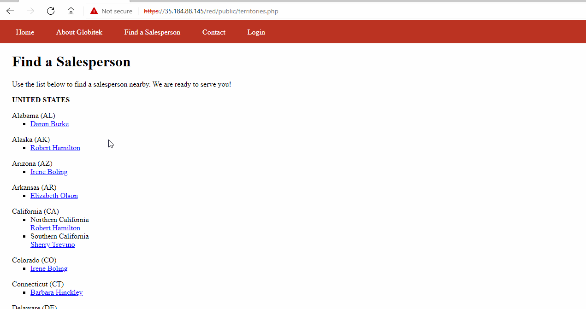
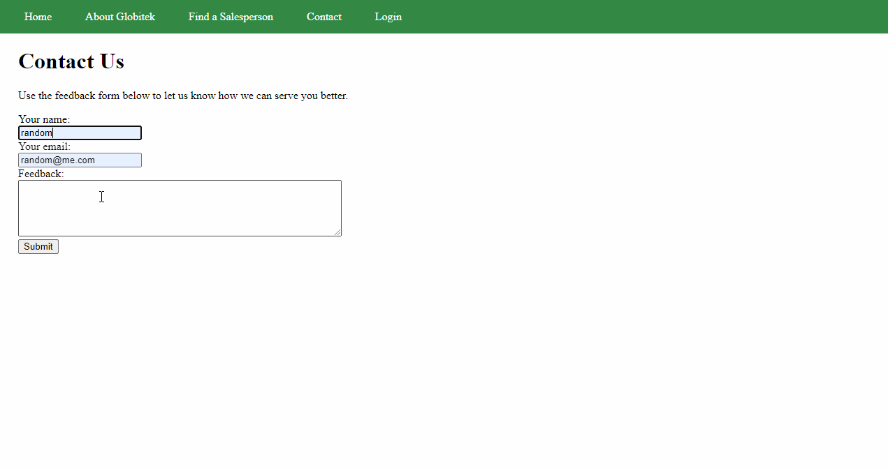

# Pen Testing Live Targets

Time spent: **3** hours spent in total

> Objective: Identify vulnerabilities in three different versions of the Globitek website: blue, green, and red.

The six possible exploits are:

* Username Enumeration
* Insecure Direct Object Reference (IDOR)
* SQL Injection (SQLi)
* Cross-Site Scripting (XSS)
* Cross-Site Request Forgery (CSRF)
* Session Hijacking/Fixation

Each color is vulnerable to only 2 of the 6 possible exploits. First discover which color has the specific vulnerability, then write a short description of how to exploit it, and finally demonstrate it using screenshots compiled into a GIF.

## Blue

Vulnerability #1: SQL Injection

Description: Direct SQL injection to the URL.

## Red

Vulnerability #1: IDOR

Description: A indirect object refrence allows you to access and see details about sales people that should be hidden

## Green

Vulnerability #1: CROSS SITE SCRIPTING XXS

Description: We are able to insert a malicous script to cause a XSS attack.

